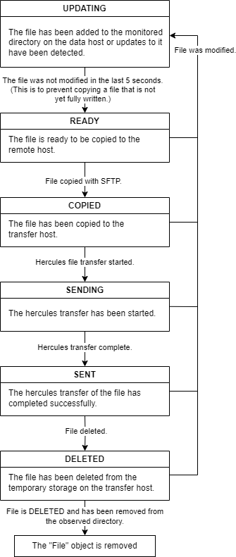

# Hercules SFTP Setup
This script is intended to run besides Hercules. It continuously monitors a directory on a local data storage node. It copies new or updated files and then starts a Hercules jobs to send each file to a remote destination. This shall provide a drag-and-drop like experience for Hercules file transfer.

## Deployment


The main goal is to send files form a local to a remote destination. In this process four machines are involved:

- **local data host**: Data storage, accessible by local users, accessible by local transfer host
- **local transfer host**: NOT accessible by users, runs Hercules Server, runs THIS script
- **remote transfer host**: NOT accessible by users, runs Hercules Server, runs THIS script
- **remote data host**: Data storage, accessible by remote users, accessible by remote transfer host

## Config
This script can be configured via a json config file. The path to the configfile can be given via command line arguments: `python3 main.py -c "config.json"`

The config file shall have the following format and fields:
```
{
    "ldh_ip": "", 
    "ldh_username": "",
    "ldh_ssh_key_file": "",
    "ldh_observe_dir": "",
    "ldh_write_dir": "",
    "lth_hercules_rcv_dir": "",
    "lth_out_temp_dir": "",
    "hercules_monitor_address": "",
    "rth_address": "",
    "rth_target_dir": ""
}
```

- **ldh_ip**: _local data host_ IP address
- **ldh_username**: _local data host_ username for SFTP login
- **ldh_ssh_key_file**: _local data host_ ssh key file for SFTP login
- **ldh_observe_dir**: _local data host_ directory to observe for outgoing files
- **ldh_write_dir**: _local data host_ directory to write incoming files to
- **lth_hercules_rcv_dir**: _local transfer host_ directory to observe for incoming hercules transfers
- **lth_out_temp_dir**: _local transfer host_ directory to temporarily store files for outgoing hercules transfers
- **hercules_monitor_address**: address to interact with Hercules via HTTP api. (default=localhost:8000)
- **rth_address**: _remote transfer host_ address. The destination address for hercules transferes. (SCION address)
- **rth_target_dir**: _remote transfer host_ target directory. The destination directory for hercules transferes.


## File States: 
This script stores file metadata as a `File` object. This includes a `FileState`. This state determines the current and next steps that must be performed on that file (copy, send, delete, ...).

The states and the state transitions are explained in the chart below.




## Open Issues
- does hercules somehow send the filename to the destination? YES the new hercules server does do this.
- does hercules handle small files? (Had issues with test files that are just a few bytes in size.)
